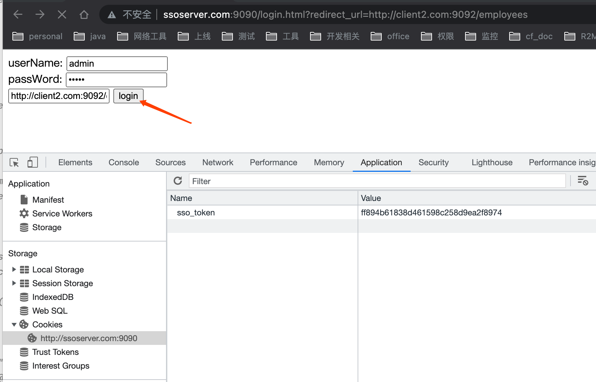
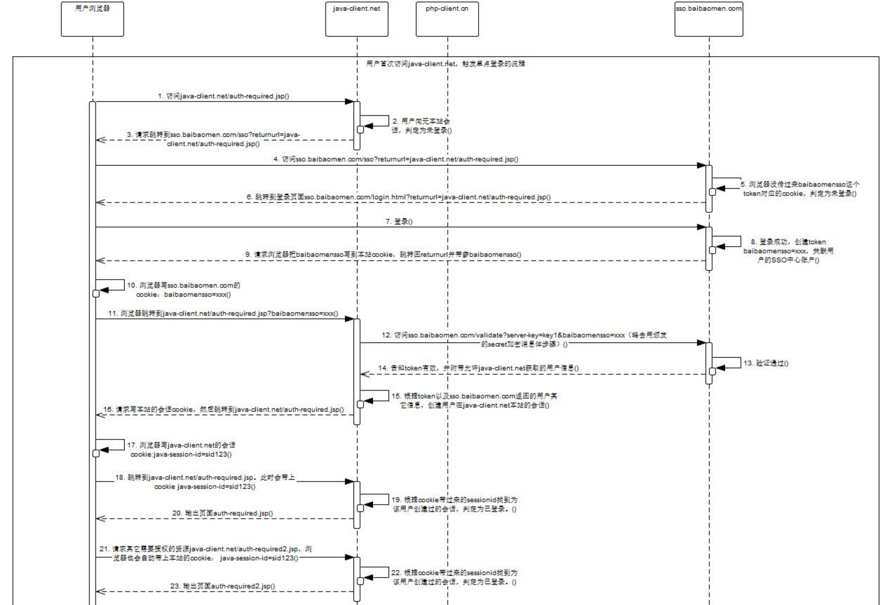
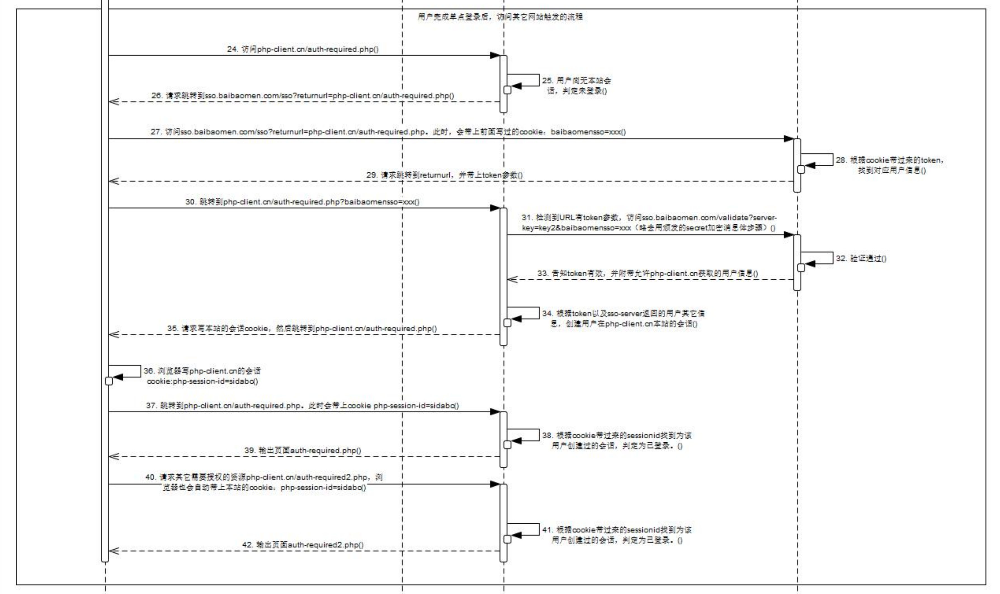

## SSO单点登录
    127.0.0.1	ssoserver.com
    127.0.0.1	client1.com
    127.0.0.1	client2.com

    sso.server.url=http://ssoserver.com:9090/login.html

### sso-server端

#### contoller服务
    
    @Controller
    public class LoginController {
    
        @Autowired
        private StringRedisTemplate stringRedisTemplate;
    
        @GetMapping("/login.html")
        public String loginPage(Model model,
                                @RequestParam("redirect_url") String redirectUrl,
                                @CookieValue(value = "sso_token", required = false) String sso_token) {

            if (!StringUtils.isEmpty(sso_token)) {
                return "redirect:" + redirectUrl + "?token=" + sso_token;
            }
            model.addAttribute("redirectUrl", redirectUrl);
            return "login";
        }
    
        @PostMapping("/doLogin")
        public String doLogin(@RequestParam("username") String username,
                              @RequestParam("password") String password,
                              @RequestParam("redirect_url") String url,
                              HttpServletResponse response) {
            if (!StringUtils.isEmpty(username) && !StringUtils.isEmpty(password)) {
                String uuid = UUID.randomUUID().toString().replace("-", "");
                stringRedisTemplate.opsForValue().set(uuid, username);
    
                // 点睛处，给sso服务的页面设置登录cookie
                Cookie sso_token = new Cookie("sso_token", uuid);
                sso_token.setMaxAge(60 * 2);
                response.addCookie(sso_token);
                return "redirect:" + url + "?token=" + uuid;
            }
            // 登录成功，跳转到之前的页面
            return "login";
        }
    
        @ResponseBody
        @GetMapping("/userInfo")
        public String userInfo(@RequestParam("token") String token) {
            return stringRedisTemplate.opsForValue().get(token);
        }
    
    }

#### 登录页面login.html

    <!DOCTYPE html>
    <html lang="en">
    <head>
        <meta charset="UTF-8">
        <title>登录页</title>
    </head>
    <body>
    
    <form action="/doLogin" method="post">
        userName: <input name="username"/> 
        passWord: <input name="password", type="password"/> 
        <input type="text" name="redirect_url" th:value="${redirectUrl}"/> //保存用于跳转回的地址
        <input type="submit" value="login"/>
    </form>
    </body>
    </html>

### sso-client端

    @Controller
    public class HelloController {
    
        @Value("${sso.server.url}")
        private String ssoServerUrl = "http://ssoserver.com:9090/login.html";
    
        /**
         * 无需登录就可访问
         *
         * @return
         */
        @ResponseBody
        @GetMapping("/hello")
        public String hello() {
            return "hello";
        }
    
        /**
         * @return
         */
        @GetMapping("/employees")
        public String employees(Model model, HttpSession session,
                                @RequestParam(value = "token", required = false) String token) {
    
            if (!StringUtils.isEmpty(token)) {
                RestTemplate restTemplate = new RestTemplate();
                // 能过服务获取用户的信息
                ResponseEntity<String> forEntity = restTemplate.getForEntity("http://ssoserver.com:9090/userInfo?token=" + token, String.class);
                String body = forEntity.getBody();
                session.setAttribute("loginUser", body);
            }
            Object loginUser = session.getAttribute("loginUser");
            if (null == loginUser) {
                // 没登录，跳转到登录服务器进行登录
                return "redirect:" + ssoServerUrl + "?redirect_url=http://client1.com:9091/employees";
            } else {
                List<String> emps = new ArrayList<>();
                emps.add("zhangSan");
                emps.add("liSi");
                model.addAttribute("emps", emps);
                return "list";
            }
        }
    
    }

### 服务端设置登录用户的cookie信息

### 用户首次访问，触发单点登录的流程

### 用户完成单点登录后，访问其它网站触发的流程

