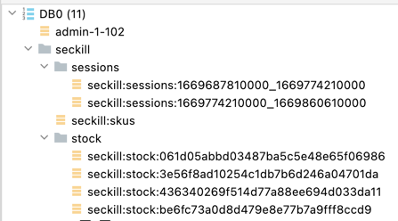
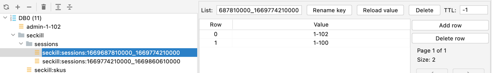
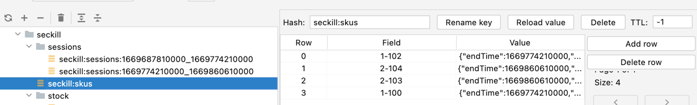
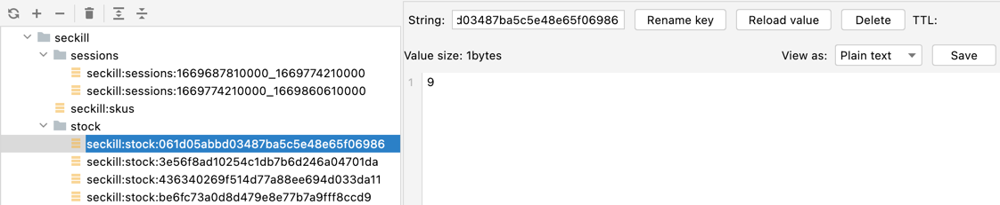

### reids 存储数据结果

    /**
     * 活动场次 list(key, [skuId1,skuId2...])
     * key: seckill:sessions:1669687810000_1669774210000
     */
    private final String SESSION_CACHE_PREFIX = "seckill:sessions:";
    /**
     * 活动商品 hash<key, skuId, goodsInfo>
     * key: seckill:skus
     */
    private final String SECKILL_SKUS_CHARE_PREFIX = "seckill:skus";
    /**
     * 参加活动的商品数量 <k, v>
     * key: seckill:stock:be6fc73a0d8d479e8e77b7a9fff8ccd9 （+商品随机码）
     */
    private final String SKU_STOCK_SEMAPHORE = "seckill:stock:";

### 1、定时轮询上架活动及商品

    @Scheduled(cron = "*/15 * * * * ? ")
    public void uploadSeckillSkuLatest3Days() throws ParseException {
        log.info("上架秒杀商品。。。");
        seckillService.uploadSeckillSkuLatest3Days();
    }

    @Override
    public void uploadSeckillSkuLatest3Days() throws ParseException {
        List<SeckillSessionWithSkusVo> sessionWithSkusVo = Arrays.asList(sessionMap.get(10000L), sessionMap.get(10001L));
        // 1、缓存活动信息
        sessionWithSkusVo.stream().forEach(session -> {
            long startTime = session.getStartTime().getTime();
            long endTime = session.getEndTime().getTime();
            String key = String.format("%s%s_%s", SESSION_CACHE_PREFIX, startTime, endTime);
            Boolean hasKey = redisTemplate.hasKey(key);
            if (!hasKey) {
                List<String> skuIds = session.getRelationSkus().stream().map(item -> String.format("%s-%s", item.getPromotionSessionId(), item.getSkuId())).collect(Collectors.toList());
                redisTemplate.opsForList().leftPushAll(key, skuIds);
            }
        });

        // 2、缓存活动的关联商品信息
        sessionWithSkusVo.stream().forEach(session -> {
            BoundHashOperations<String, Object, Object> hashOps = redisTemplate.boundHashOps(SECKILL_SKUS_CHARE_PREFIX);
            session.getRelationSkus().stream().forEach(seckillSkuVo -> {
                String token = UUID.randomUUID().toString().replace("-", "");
                String redisKey = String.format("%s-%s", seckillSkuVo.getPromotionSessionId(), seckillSkuVo.getSkuId());
                if (!hashOps.hasKey(redisKey)) {
                    //缓存我们商品信息
                    SeckillSkuRedisTo redisTo = new SeckillSkuRedisTo();
                    redisTo.setSkuInfo(skuMap.get(seckillSkuVo.getSkuId()));
                    BeanUtils.copyProperties(seckillSkuVo, redisTo);
                    redisTo.setStartTime(session.getStartTime().getTime());
                    redisTo.setEndTime(session.getEndTime().getTime());
                    redisTo.setRandomCode(token);
                    hashOps.put(String.format("%s-%s", seckillSkuVo.getPromotionSessionId(), seckillSkuVo.getSkuId()), JSON.toJSONString(redisTo));
                    // 初始化信号量（商品库存）
                    RSemaphore semaphore = redissonClient.getSemaphore(SKU_STOCK_SEMAPHORE + token);
                    semaphore.trySetPermits(seckillSkuVo.getSeckillCount());
                }
            });
        });
    }

### 2、获取到当前可以参加秒杀商品的信息

    @Override
    public List<SeckillSkuRedisTo> getCurrentSeckillSkus() {
        Set<String> keys = redisTemplate.keys(SESSION_CACHE_PREFIX + "*");
        for (String key : keys) {
            // seckill:sessions:1669601410000_1669687810000
            String[] sessions = key.replace("seckill:sessions:", "").split("_");
            long startTime = Long.parseLong(sessions[0]);   // 开始时间
            long endTime = Long.parseLong(sessions[1]);     // 结束时间
            long currentTime = System.currentTimeMillis();  // 当前时间
            if (startTime < currentTime && currentTime < endTime) {
                List<String> range = redisTemplate.opsForList().range(key, -100, 100);
                assert range != null;
                // 获取所有活动商品
                BoundHashOperations<String, String, String> operations = redisTemplate.boundHashOps(SECKILL_SKUS_CHARE_PREFIX);
                List<String> listValue = operations.multiGet(range);
                if (null != listValue && listValue.size() >= 0) {
                    return listValue.stream().map(item -> JSON.parseObject(item, SeckillSkuRedisTo.class)).collect(Collectors.toList());
                }
            }
        }
        return null;
    }

### 3、根据skuId查询商品是否参加秒杀活动

    @Override
    public SeckillSkuRedisTo getSkuSeckilInfo(Long skuId) {
        BoundHashOperations<String, String, String> hashOps = redisTemplate.boundHashOps(SECKILL_SKUS_CHARE_PREFIX);
        Set<String> keys = hashOps.keys();
        if (null != keys && keys.size() > 0) {
            String reg = "\\d-" + skuId;
            for (String key : keys) {
                if (Pattern.matches(reg, key)) {
                    String redisValue = hashOps.get(key);
                    SeckillSkuRedisTo redisTo = JSON.parseObject(redisValue, SeckillSkuRedisTo.class);
                    long currentTime = System.currentTimeMillis();
                    Long startTime = redisTo.getStartTime();
                    Long endTime = redisTo.getEndTime();
                    if (startTime < currentTime && currentTime < endTime) {
                        return redisTo;
                    }
                    redisTo.setRandomCode(null);
                    return redisTo;
                }
            }
        }
        return null;
    }

### 4、秒杀

    @Override
    public String kill(String killId, String key, Integer num) throws InterruptedException {
        long begin = System.currentTimeMillis();
        //1、获取当前秒杀商品的详细信息从Redis中获取
        BoundHashOperations<String, String, String> hashOps = redisTemplate.boundHashOps(SECKILL_SKUS_CHARE_PREFIX);
        String skuInfoValue = hashOps.get(killId);
        if (!StringUtils.hasText(skuInfoValue)) {
            return null;
        }
        SeckillSkuRedisTo redisTo = JSON.parseObject(skuInfoValue, SeckillSkuRedisTo.class);
        Long startTime = redisTo.getStartTime();
        Long endTime = redisTo.getEndTime();
        long currentTime = System.currentTimeMillis();
        if (startTime <= currentTime && currentTime <= endTime) {
            // 2、校验随机码和商品ID
            String randomCode = redisTo.getRandomCode();
            String skuId = String.format("%s-%s", redisTo.getPromotionSessionId(), redisTo.getSkuId());
            if (key.equals(randomCode) && killId.equals(skuId)) {
                // 3、验证购物数量是否合理和库存量是否充足
                Integer seckillLimit = redisTo.getSeckillLimit();
                // 获取信号量
                String seckillCount = redisTemplate.opsForValue().get(SKU_STOCK_SEMAPHORE + randomCode);
                Integer count = Integer.valueOf(seckillCount);
                if (count > 0 && count > num && num <= seckillLimit) {
                    // 4、验证这个人是否已经购买过（幂等性处理），如果秒杀成功: userId-sessionId-skuId
                    // SETNX 原子性处理
                    String userKey = (String) SecurityContextHolder.getContext().getAuthentication().getPrincipal();
                    String redisKey = String.format("%s-%s", userKey, skuId);
                    Long ttl = endTime - currentTime;
                    // 是否已占过坑
                    Boolean ifAbsent = redisTemplate.opsForValue().setIfAbsent(redisKey, num.toString(), ttl, TimeUnit.MILLISECONDS);
                    if (ifAbsent) {
                        RSemaphore semaphore = redissonClient.getSemaphore(SKU_STOCK_SEMAPHORE + randomCode);
                        boolean semaphoreCount = semaphore.tryAcquire(num, 100, TimeUnit.MILLISECONDS);
                        if (semaphoreCount) {
                            String orderId = UUID.randomUUID().toString();
                            SeckillOrderTo orderTo = new SeckillOrderTo();
                            orderTo.setOrderSn(orderId);
                            orderTo.setMemberId(1L);
                            orderTo.setNum(num);
                            orderTo.setPromotionSessionId(redisTo.getPromotionSessionId());
                            orderTo.setSkuId(redisTo.getSkuId());
                            orderTo.setSeckillPrice(redisTo.getSeckillPrice());
                            // TODO 发送MQ
                            rabbitTemplate.convertAndSend("order-event-exchange", "order.seckill.order", orderTo);
                            return orderId;
                        }
                    }
                }
            }
        }
        long end = System.currentTimeMillis();
        System.out.println(String.format("耗时: %n", (end - begin)));
        return null;
    }

